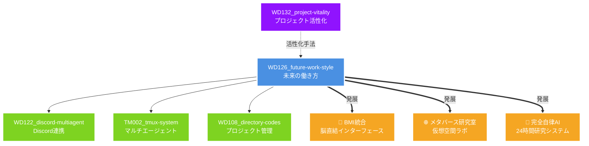

# WD126_future-work-style - 未来の働き方プロジェクト

## 🌸 プロジェクト健康状態

```
総合健康度: ████████████████████░ 95% 🌺満開期

📊 進捗状況
├─ ビジョン策定     ████████████████████ 100% ✅
├─ 概念設計        ████████████████████ 100% ✅
├─ サンプル作成     ████████████████░░░░ 80%  🚧
├─ 実装           ████████░░░░░░░░░░░░ 40%  🔧
└─ ドキュメント     ██████████████████░░ 90%  📝

🔥 活動ストリーク: 1日連続
⏰ 最終更新: 2025年7月25日
💪 エネルギーレベル: ███████░░░ 70%
```

## ⚡ 5分でできるクイックタスク

### 今すぐできる改善
- [ ] 🎯 thoughts-and-ideas.mdに新しいアイデアを1つ追加
- [ ] ⚡ README内のタイポチェック
- [ ] 💎 examples内の1ファイルに図解説明を追加
- [ ] 🌟 vision.mdの1セクションを読み返して改善点をメモ
- [ ] 🔥 関連プロジェクトとのリンクを1つ追加

## プロジェクト概要

Claude Codeなどの先進的なAI技術を活用した未来の働き方を具体化するプロジェクトです。人間とAIが協調することで、生産性の向上だけでなく、創造性の拡張と働く人々のウェルビーイング向上を実現する新しい労働パラダイムを探求します。

## 対象者

- 28歳男性医師・研究者
- 物理的な体力・時間制限を持つ知識労働者
- 研究・開発・コンテンツクリエイター
- 多動的な活動をする現代のプロフェッショナル

## プロジェクト構成

```
WD126_future-work-style/
├── docs/
│   └── vision.md          # AI協調による未来の働き方ビジョン
├── examples/
│   ├── ai-assisted-development.md      # AI支援開発ワークフロー例
│   ├── multi-agent-collaboration.md    # マルチエージェント協調例
│   ├── creative-ai-partnership.md      # クリエイティブAIパートナーシップ例
│   ├── research-data-analysis-workflow.md  # 研究データ解析ワークフロー
│   ├── life-optimization-daily-model.md    # 一日の最適化モデル
│   └── ergonomics-workspace-setup.md      # エルゴノミクス最適化
├── src/
│   ├── multi_agent_demo.py              # マルチエージェントデモ
│   ├── research_productivity_system.py   # 研究生産性向上システム
│   ├── lifelog_integration_system.py    # ライフログ統合システム
│   ├── discord_mobile_bridge.py         # Discord連携システム
│   └── voice_development_interface.py   # 音声開発インターフェース
└── README.md
```

## 主要コンセプト

### 1. AI協調作業（AI-Human Collaboration）
人間の創造性とAIの処理能力を最適に組み合わせた新しい働き方

### 2. 研究生産性の劇的向上
- データ生成・解析の自動化
- 仮説生成エンジンによる創造的研究
- 論文執筆支援システム
- 競争的研究費獲得支援

### 3. ライフスタイル最適化
- エネルギー管理の科学的アプローチ
- スマートデバイスエコシステム
- 音声駆動タスク管理
- どこでも開発環境

### 4. 物理環境の知能化
- エルゴノミクス最適化
- 自動化による時間創出
- 健康維持システム

## 期待される成果

### 定量的指標
- 研究データ生成量: 10倍増
- 仮説提案数: 20倍増
- 論文執筆速度: 3倍
- 作業効率: 200%向上
- 家事時間: 年間500時間削減

### 定性的指標
- 創造的作業への集中時間増加
- 身体的疲労の最小化
- 精神的ウェルビーイングの向上
- ワークライフバランスの最適化

## 技術スタック

- **AI基盤**: Claude Code, GPT-4, カスタムLLM
- **開発環境**: Python, TypeScript, React
- **連携ツール**: Discord API, GitHub Actions
- **ハードウェア**: スマート家電、エルゴノミクス機器
- **音声技術**: Limitless AI, 音声認識/合成

## 今後の展望

### 短期（6ヶ月）
- プロトタイプシステムの構築
- 個人環境での実証実験
- 効果測定と改善

### 中期（1-2年）
- システムの統合と最適化
- コミュニティへの展開
- オープンソース化

### 長期（3-5年）
- 標準化された働き方モデル
- 社会実装と普及
- 次世代技術との統合

## 関連プロジェクトマップ



## 🎯 次のアクション提案

### 即実行（5分以内）
1. **アイデア追加** → thoughts-and-ideas.mdを開いて思いついたことを記録
2. **ビジュアル構想** → visual-concepts.mdに新しい図解アイデアを追加
3. **Vive体験** → 何か小さなものをVive Paradigmで学習

### 短期目標（今週中）
1. **プロトタイプ作成** → 1つの機能を実際に動かしてみる
2. **フィードバック収集** → 誰かに見せて意見をもらう
3. **改善サイクル** → 小さな改善を3つ実施

### 中期ビジョン（今月中）
1. **統合テスト** → 複数の要素を組み合わせて検証
2. **ドキュメント充実** → 使い方ガイドの作成
3. **コミュニティ形成** → 興味を持つ人を見つける

## 参加方法

本プロジェクトは現在構想段階です。アイデア、フィードバック、協力のご提案を歓迎します。

### 貢献の仕方
- 💡 アイデア: thoughts-and-ideas.mdに追加
- 🐛 バグ報告: Issueを作成
- 🎨 ビジュアル: visual-concepts.mdに構想を追加
- 📝 ドキュメント: 分かりやすい説明を追加

## ライセンス

MIT License

## 連絡先

GitHub: @NSada2025

---

*最終更新: 2025年7月25日*
*プロジェクトコード: WD126*
*健康度: 95% 🌺*
